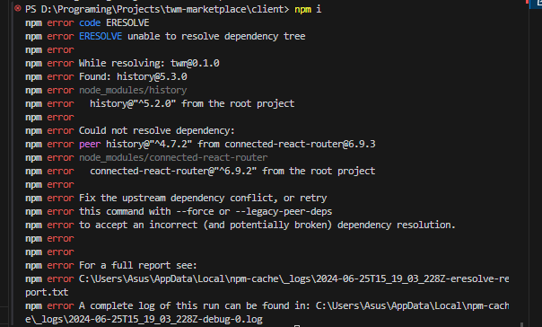
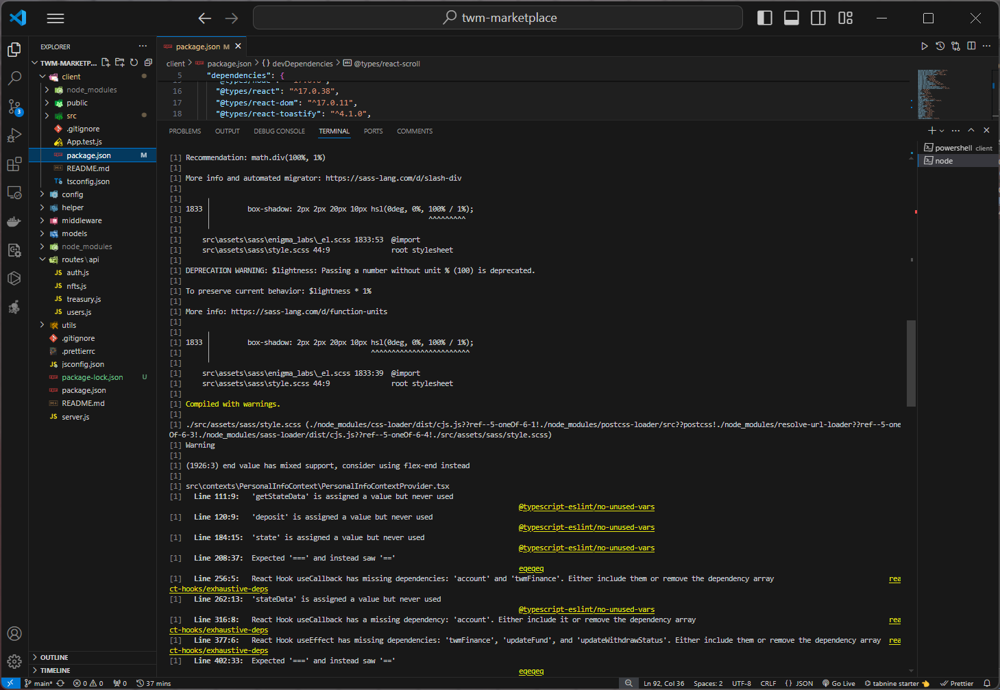
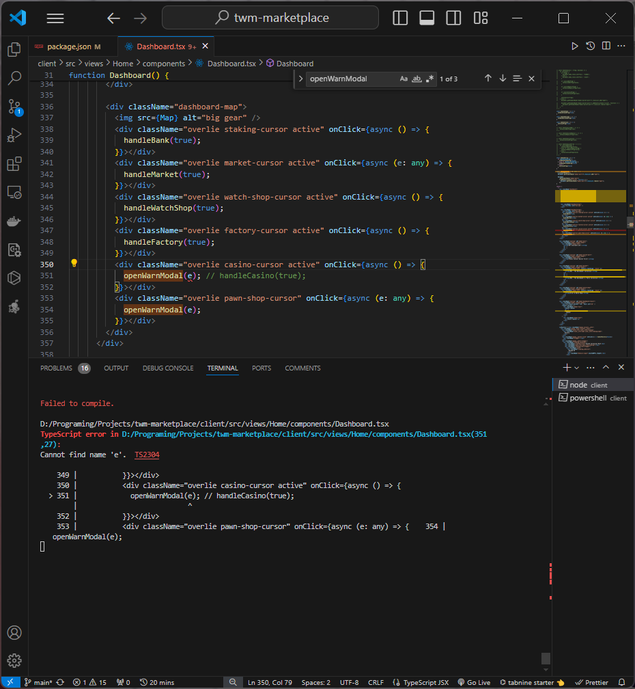
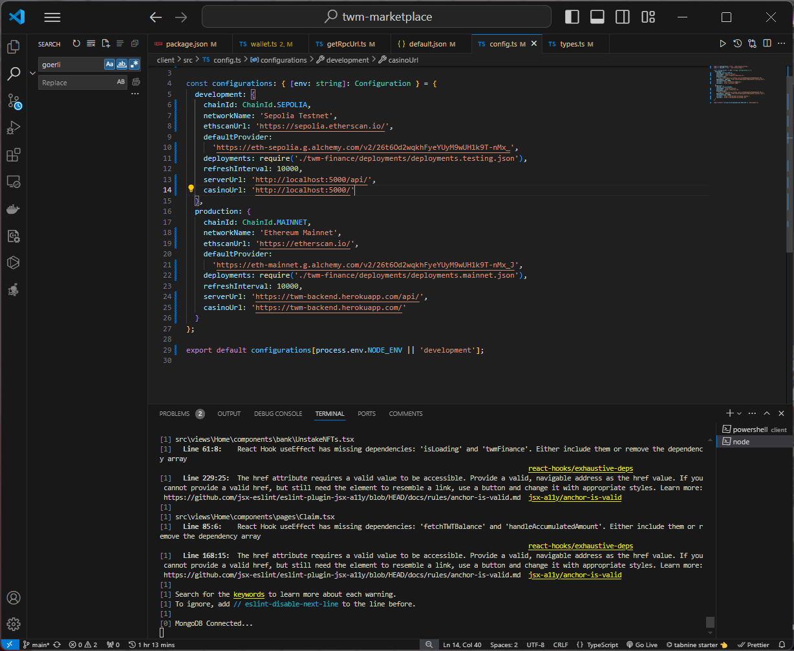
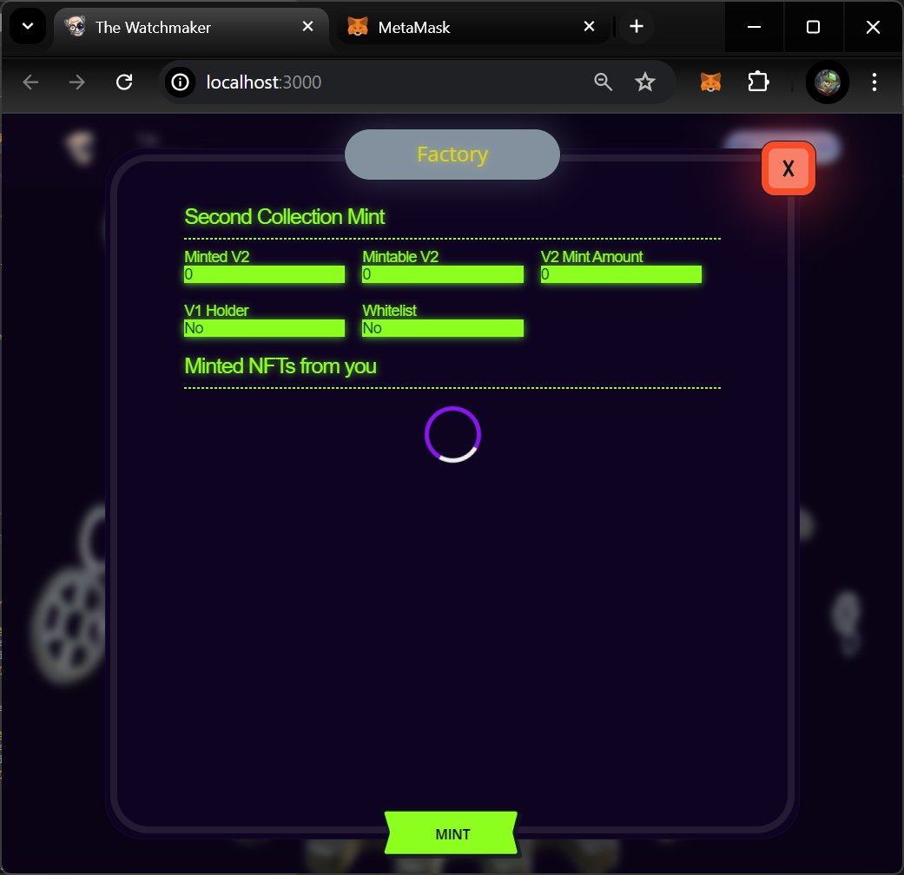
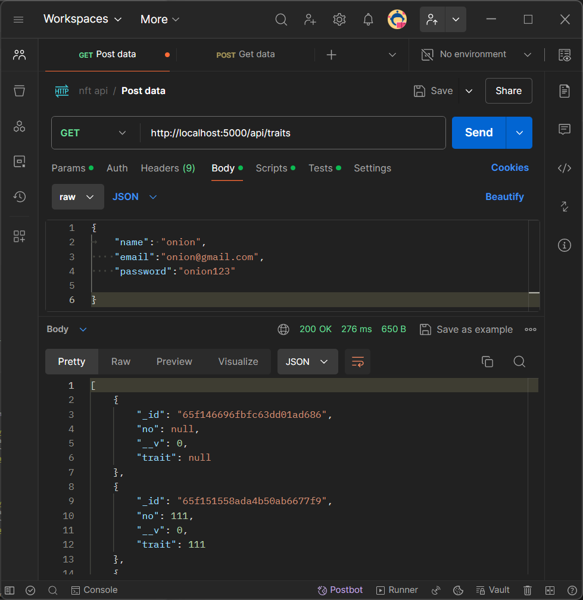
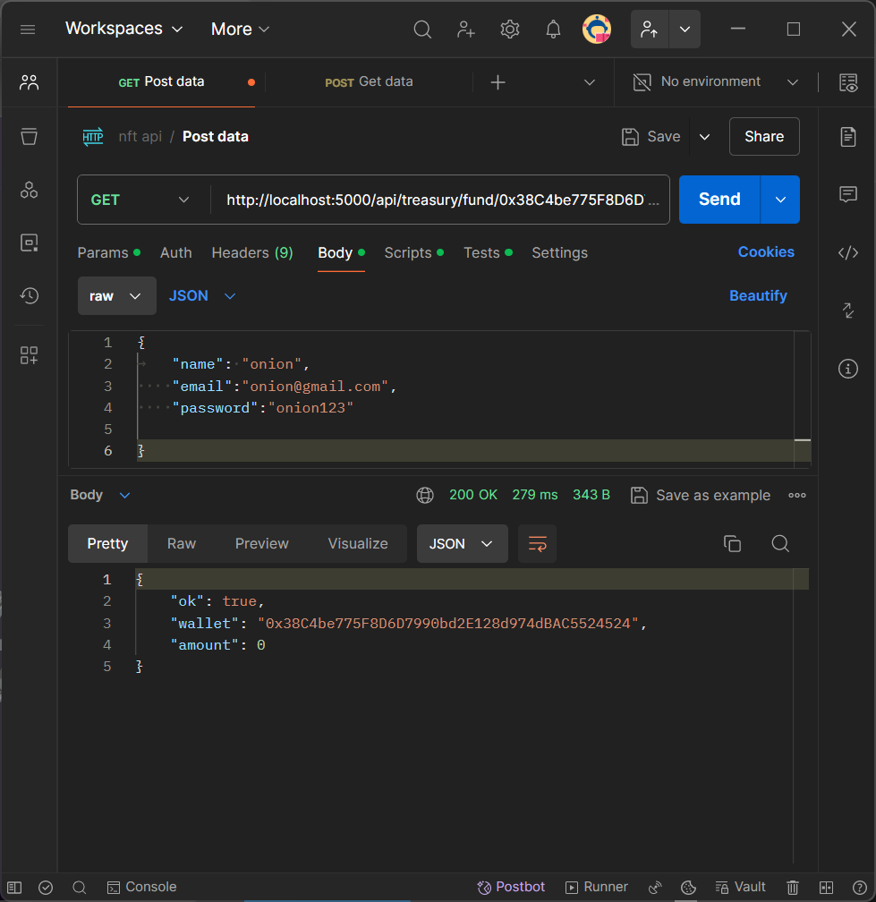
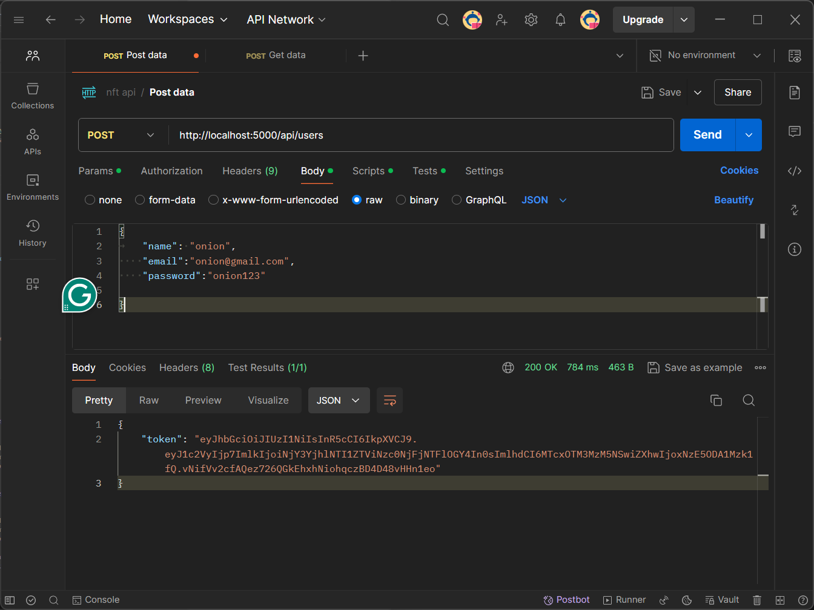

The Watchmaker merges a passion and innovation, in a brand-new watch marketplace with crypto payments and the integration of the NFTs into the own world.

# WATCHSHOP FRONTEND

## FRONTEND

```bash
yarn install
yarn start
```

<br/>
<br/>

<h1>#### Bugs and Fixes</h1>
<h3>During the development process, I encountered and resolved several issues:</h3>
<br/>

<h2>1. I changed my node version to v18.20.3 before installing the package </h2>
<br>

<h2>2. when I wanted to install the package I got an error that the versions of history and connect-react-roter did not match so I fixed it from history@^5.3.0 to history@^4.7.2 and connected-react-router@^6.7.2 to connected- react-router@^6.7.3</h2>

<br>

<h2>3. I fixed a bug in client\src\assets\sass\enigma_labs_el.scss</h2>

<br>

<h2> 4. After I fixed \_el.scss I got the error again in client\src\views\Home\components\Dashboard.tsx that the function openWarnModal(e); An error occurred because it did not send parameters when clicked
</h2>

<br>

<h2>5. After I fixed the error the program ran smoothly, but when I wanted to connect the wallet an error occurred that Goerli was no longer supported so I changed the network from Goerli to Sepolia</h2>
<br>
<h2>changing the network to sepolia: </h2>
<br>

<br>

<h2>6. This is the result after I corrected all the error codes</h2>

<br>
<br>
<br>


<h1>#### After I fixed the bug in the client, I immediately tested the server in Postmant and didn't find any errors</h1>
<br>

<h2>1. testing on the /api/traits url</h2>

<br>

<h2>2. testing on the /api/treasury/fund/:wallet url</h2>

<br>

<h2>3. testing on the /api/users url</h2>

<br>
